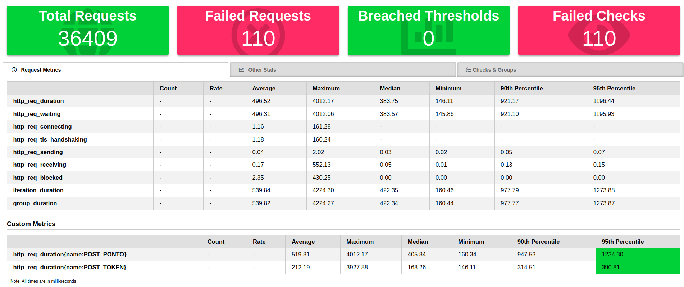
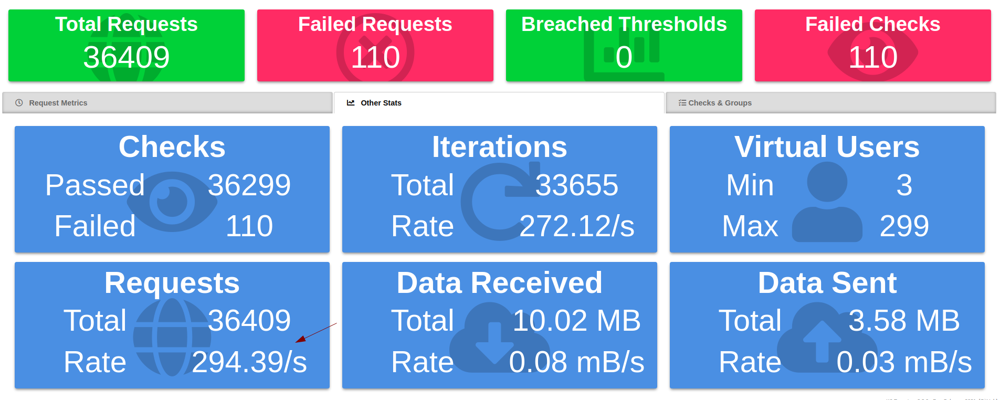
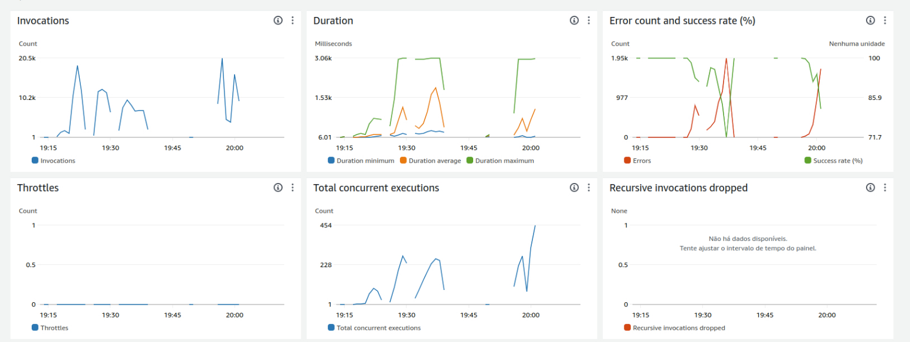
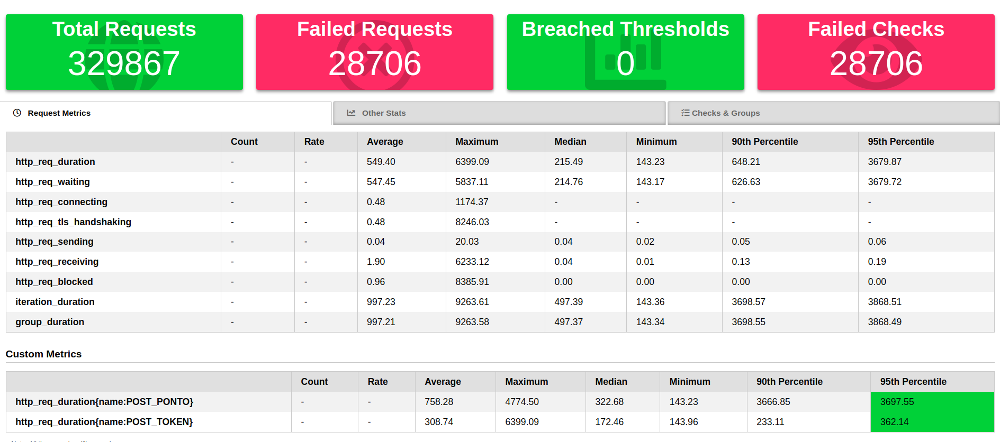
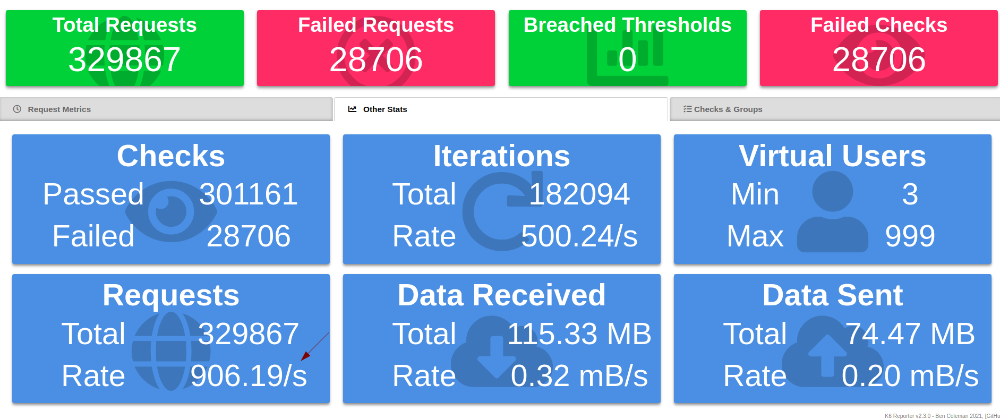
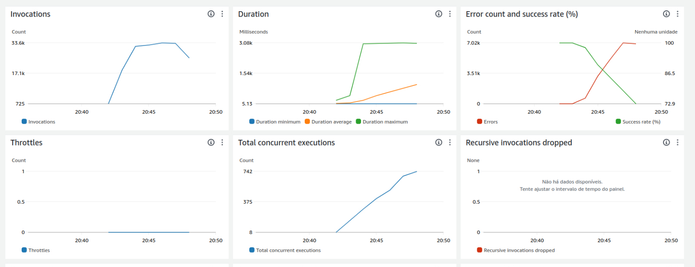

## Testes de carga

Foram realizados dois testes de carga a fim de validar o comportamento da solução.

## Teste 1

Foram parametrizados 300 usuários virtuais durante o intervalo de 2 minutos

Lambda

## Teste 2

Foram parametrizados 1000 usuários virtuais durante o intervalo de 6 minutos

Lambda

